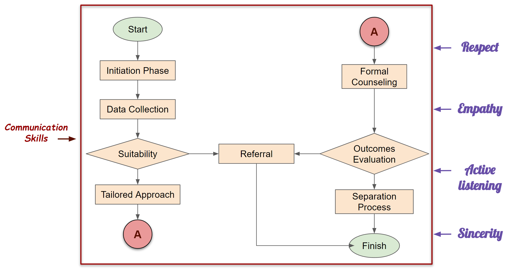
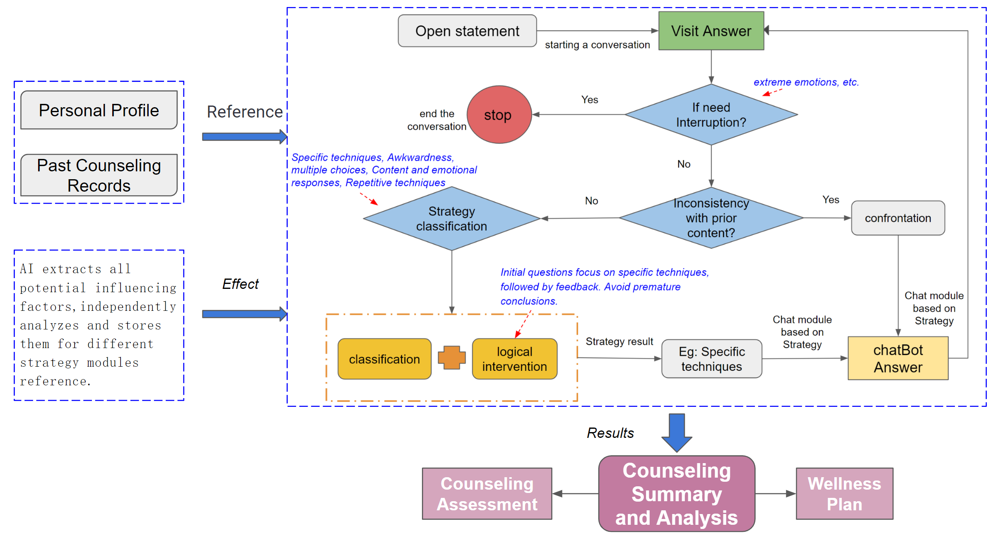

# YouthMentalHealthCounseling_Chat

## Keywords
- Mental Health Counseling
- ChatBot
- ChatGPT
- Youth
- Teenager
# Target

Building a chat+micro-counseling product based on ChatGPT as the underlying technology aims to assist more individuals in need of psychological support. The goal is to intervene during the early stages of psychological issues, preventing their escalation, and make psychological counseling accessible to a wider audience, particularly in regions lacking professional counseling services. Currently, for severe psychological issues, access to professional counselors is provided for complex interventions, optimizing resource allocation. In the future, with accumulating data, chat systems may explore addressing more complex psychological problems.

# Background
1. According to the World Health Organization, over 3 billion people globally need psychological intervention, but only around 10% have access to counseling, mainly due to a shortage of professional psychologists and regional disparities.
2. The fast-paced era has led to a surge in youth psychological issues, distinct in their complexity and challenges, including detection difficulties and multifaceted causal factors involving family, peers, and society.
3. Effective psychological counseling is most noticeable during early-stage problems, often overlooked, making issues escalate before seeking help, requiring more time and effort for substantial improvement.
4. The rise of "smiling depression" links to youth-facing psychological issues, as they outwardly appear positive but hide inner stress, lacking outlets for confiding, leading to severe psychological issues and extreme behaviors.
5. Student populations experience increasingly severe psychological issues, requiring more attention and informal conversations for addressing their evolving self-awareness.

# Product Features and Uniqueness
1. AI combines professional knowledge and techniques to help individuals with mild psychological issues, providing guidance and constructive feedback.
2. AI counseling is available anytime, anywhere, offering a patient ear for concerns, no matter how small they may seem to others.
3. AI counseling is cost-effective, eliminating financial worries compared to traditional counseling.
4. AI counseling aims to prevent issues from worsening, paying attention to all concerns and recommending experts when needed.
5. AI counseling is ideal for the younger generation, offering informal and convenient support.
6. AI counseling serves as a friend, listening to young people's struggles and offering proactive advice.
7. AI counseling provides parents with child psychology-based advice on maintaining healthy parent-child relationships.

# Workflow

1. **Initiation Phase**: AI Psychology introduces its key attributes, such as possessing professional psychological counseling knowledge and the ability to utilize various psychological approaches. It also establishes the user's responsibilities and agreements governing continued counseling.
2. **Data Collection**: This involves collecting basic personal information, such as age, ethnicity, and tendencies towards psychological issues.
3. **Suitability Assessment**: AI assesses whether the user is a suitable candidate for psychological counseling. Severe conditions, like severe depression or a lack of self-awareness for self-assessment, may indicate inappropriateness.
4. **Tailored Approach**: AI briefly explains the merits of different psychological schools, such as psychoanalysis, humanism, behaviorism, and cognitive therapy. These schools address different psychological issues and provide distinct experiences. For instance, humanism focuses on highlighting users' positive aspects and encourages using their strengths to address problems, offering warmth and motivational language during sessions.
5. **Formal Counseling: AI Psychology applies relevant techniques to address the user's concerns.
6. **Evaluation of Outcomes**: After the counseling session, AI assists users in reviewing their progress and insights gained during the process. It offers positive recommendations and determines if further sessions are needed, scheduling the next visit accordingly.
7. **Separation Process**: This step is initiated post-counseling to address potential transference and dependency issues that may arise during the counseling process. AI emphasizes the need for users to handle certain matters independently while reassuring them that they can seek assistance whenever necessary, avoiding ethical concerns common in face-to-face interactions.

# Formal Counseling ChatBot Design

1. **Opening Statement**: Begin with an open-ended question or statement, serving as the conversation opener. No judgment is needed here.
2. **Assessing Emotional Extremes**: After the user responds to each dialogue sentence, the AI technology first assesses if the user's emotions are extreme enough to warrant interruption. If interruption is necessary, the conversation proceeds to the next phase; otherwise, it continues.
3. **Checking for Contradictions**: If there's no need for interruption, the logical step involves checking for contradictions in the user's responses compared to their previous answers. In the case of contradictions, the counselor employs confrontational techniques; otherwise, the evaluation proceeds. From an AI technology perspective, confrontational techniques are distinct and require analyzing all previous dialogues, separating them from other psychological techniques.
4. **Assessing Appropriate Psychological Techniques**: If no contradictions are found, the next step is to determine which psychological technique the user's response should be addressed with. This determination combines the user's response and logical intervention.
   + The available techniques include：
      - Specific techniques
      - Content and emotional reactions
      - Open-ended questioning
      - Closed-ended questioning
      - Awkwardness
      - Confrontation
      - Repetitive techniques
      - Creating pauses
      - Multiple-choice questions
   + Logical Interventions: Logical interventions encompass several principles, such as prioritizing specific techniques in the first four to five questions, tying feedback to specific techniques after every one or two uses, and avoiding prematurely presenting conclusions.
5. **Counselor's Response Module for each technique**: Based on the assessment of the psychological technique, **Design and Create** ChatGPT based specific module for each technique, generate next response more appropriately.
6. **Returning the Response to the User**: The generated response is then returned to the user, and the conversation proceeds accordingly.
